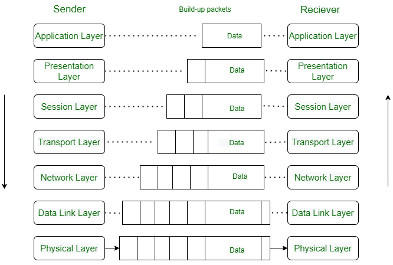

# Notes that are wifi/network related
- [Adding a wifi interface](#adding-a-wifi-interface)
- [Add IP address to interface](#add-ip-address-to-interface)
- [Address Resolution Protocol (ARP)](#address-resolution-protocol)
- [Changing wifi interface](#changing-wifi-interface)
- [Deleting a wifi interface](#deleting-a-wifi-interface)
- [How data flows in the OSI Model?](#how-data-flows-in-the-osi-model)
- [Internet Control Message Protocol (ICMP)](#icmp)
- [OSI Network Model](#osi-network-model)
- [Physical Transmission Modes](#physical-transmission-modes)
- [Putting wifi interface in monitor mode](#putting-wifi-interface-in-monitor-mode)
- [Setting up wifi and hotspot manually](#setting-up-wifi-and-hotspot-manually)
- [TCP/IP Network Model](#tcpip-network-model)

---
## Putting wifi interface in monitor mode
### Using `ip` and `iw` commands
```
ip link set wlan0 down
iw wlan0 set monitor none
ip link set wlan0 up
```

### Using `iwconfig`
```
ifconfig wlan0 down
iwconfig wlan0 mode monitor
ifconfig wlan0 up
```

---
## Adding a wifi interface
```
iw phy0 interface add myAp type __ap
```
- Note that there should be two underscores in '__ap'

---
## Deleting a wifi interface
```
iw dev myAp del
```

---
## Changing wifi interface
### To managed
```
iw myAp set type managed
```

### To AP mode
```
iw myAp set type __ap
```

---
## OSI Network Model
### The OSI (Open Systems Interconnection) model has seven layers in total
- Layer 1, Physical Layer:
    #### Details
    The lowest layer of the OSI reference model is the Physical Layer. It is responsible for the actual physical connection between the devices. The physical layer contains information in the form of **bits**. Physical Layer is responsible for transmitting individual bits from one node to the next. When recieving data, this layer will get the signal recieved and convert it into 0s and 1s and send them to the Data Link Layer, which will put the frame back together. Common layer devices are Hub, Repeater, Modem and Cables.
    #### Functions of the Physical Layer
    - **Bit Synchronization**: The physical layer provides the synchronization of the bits by providing a clock. This clock controls both sender and reciever thus providing synchronization at the bit level.
    - **Bit Rate Control**: The Physical Layer also defines the transmission rate i.e the number of bits per second.
    - **Physical Topologies**: The Physical Layer specifies how the different devices/nodes are arranged in a network i.e. [bus topology](#bus-topology), [star topology](#star-topology), or [mesh topology](#mesh-topology).
    - **Transmission Mode**: Physical layer also defines how the data flows between the two connected devices. The various transmission mosed possible are [Simples, half-duplex and full-duplex](#physical-transmission-modes).
    #### Summary
    - Deals with the physical medium for data transmission, such as cables, switches, and radio waves. It focuses on bit-level transmission between devices.
    - Examples:
        - Ethernet cables (Cat 5e, Cat 6)
        - WiFi (802.11 standards)
        - Fiber optics
    - Devices: Hubs, repeaters, network interface cards (NICs)
    - Key Protocols/Standards:
        - IEEE 802.3 (Ethernet)
        - RS-232 (Serial communication)

- Layer 2, Data Link Layer:
    #### Details
    The data link layer is responsible for the node-to-node delivery of the message. The main function of this layer is to make sure data transfer is error-free from one node to another, over the physical layer. When a packet arrives in a network, it is the responsibility of the DLL to transmit it to the Host using its [MAC address](#mac-address). Packet in the Data Link Layer is referred to as **Frame**. Switchs and Bridges are common Data Link Layer devices.\

    The Data Link Layer is divided into two sublayers:
    - Logical Link Control (LLC)
    - Media Access Control (MAC)

    The packet recieved from the Network Layer is further divided into frames depending on the frame size of the NIC(Network Interface Card). DLL also encapsulates Sender and Reciever's MAC address in the header.

    The Reciever's MAC address is obtained by placing an [ARP(Address Resolution Protocol)](#address-resolution-protocol) request onto the wire asking "Who has that IP address?" and the destination host will reply with its MAC address.
    #### Functions of the Data Link Layer
    - **Framing**: Framing is a function of the data link layer. It provides a way for a sender to transmit a set of bits that are meaningful to the reciever. This can be accomplished by attaching special bit patterns to the beginning and end of the frame.
    - **Physical Addressing**: After creating frames, the Data Link Layer adds physical addresses (MAC addresses) of the sender and/or reciever in the header of each frame.
    - **Error Control**: The Data Link Layer provides the mechanism of error control in which it detects and retransmits damaged or lost frames.
    - **Flow Control**: The data rate must be constant on both sides else the data may get corrupted thus, flow control coordinates the amount of data that can be sent before recieving an acknowledegment.
    - **Access Control**: When a single communication channel is shared by multiple devices, the MAC sub-layer of the data link layer helps to determine which device has control over the channel at a given time.
    #### Summary
    - Provides error detection and correction for frames and manages access to the physicsl medium. It includes two sublayers:
        - MAC (Media Access Control): Governs access to the network medium.
        - LLC (Logical Link Control): Manages frame synchronization and flow control.
    - Examples:
        - Ethernet framing
        - Point-to-Point Protocol (PPP)
    - Devices: Switches, bridges
    - Key Protocols/Standards:
        - IEEE 802.3 (Ethernet)
        - IEEE 802.11 (WiFi)
        - ARP (Address Resolution Protocol)

- Layer 3, Network Layer:
    #### Details
    The network layer works for the transmission of data from one host to the other located in different networks. It also takes care of packet routing i.e. selection of the shortest path to transmit the packet, from the number of routes available. The sender and reciever's [IP address](#ip-address) are placed in the header by the network layer. Segment in the Network Layer is referred to as **Packet**. Network layer is implemented by networking devices such as routers and switches.
    #### Functions of the Network Layer
    - **Routing**: The network layer protocols determing which route is suitable from source to destination. This function of the network layer is known as routing.
    - **Logical Addressing**: To identify each device inter-network uniquely, the network layer defines an addressing scheme. The sender and reciever's IP addresses are placed in the header by the network layer. Such an address distinguishes each device uniquely and universally.
    #### Summary
    - Determines how data is routed and forwarded between devices. It manages logical addressing (IP addresses) and handles packet switching.
    - Examples:
        - IP (Internet Protocol) - IPv4, IPv6
        - ICMP (Internet Control Message Protocol)
        - RIP, OSPF (Routing Protocols)
    - Devices: Routers, Layer 3 switches
    - Key Protocols/Standards:
        - IPv4, IPv6
        - MPLS (Multi Protocol Label Switching)

- Layer 4, Transport Layer:
    #### Details
    The transport layer provides services to the application layer and takes services from the network layer. The data in the transport layer is referred to as **Segments**. It is responsible for the end-to-end delivery of the complete message. The transport layer also provides acknowledgement of the successful data transmission and re-transmits the data if an error is found. Protocols used in Transport Layer are [TCP](#tcp), [UDP](#udp), [NetBIOS](#netbios), [PPTP](#pptp).

    **At the sender's side**, the transport layer recieves the formatted data from the upper layers, performs **Segmentation**, and also implements **Flow and error control** to ensure proper data transmission. It also adds Source and Destination **port number** in its header and forwards the segmented data to the Network Layer.
    - Generally, this destination port number is configured, either by default or manually. For example, when a web application requests a web server, it typically uses port number 80, because this is the default port assigned to web applications. Many applications have default ports assigned.

    **At the reciever's side**, Transport Layer reads the port number from its header and forwards the Data which it has recieved to the respective application. It also performs sequencing and reassembling of the segmented data.
    #### Functions of the Transport Layer
    - **Segmentation and Reassembly**: The layer accepts the message from the (session) layer, and breaks the message into smaller units. Each of the segments produced has a header associated with it. The transport layer at the destination station reassembles the message.
    - **Service Point Addressing**: To deliver the message to the correct process, the transport layer header includes a type of address called service point address or port address. Thus by specifying this address, the transport layer makes sure that the message is delivered to the correct process.
    #### Services Provided by Transport Layer
    - [Connection-Oriented Service](#connection-oriented-service)
    - [Connectionless Service](#connectionless-service)
    #### Summary
    - Ensures reliable transmission of data between hosts, providing error recovery and flow control. It breaks down messages into segments and reassembles them on the recieving end.
    - Examples:
        - UDP (User Datagram Protocol) - Reliable, connection-oriented
        - TCP (Transmission Control Protocol) - Unreliable, connectionless
    - Devices: End-Host systems (software-based)
    - Key Protocols/Standards:
        - TCP
        - UDP

- Layer 5, Session Layer:
    #### Details
    Session Layer in the OSI Model is responsible for the establishment of connections, management of connections, terminations of sessions between two devices. It also provides authentication and security. Protocols used in the Session Layer are [NetBIOS](#netbios), [PPTP](#pptp).
    #### Functions of the Session Layer
    - **Session Establishment, Maintenance, and Termination**: The layer allows the two processes to establish, use and terminate a connection.
    - **Synchronization**: This layer allows a process to add checkpoints that are considered synchronization points in the data. These synchronization points help to identify the error so that the data is re-synchronized properly, and ends of the messages are not cut prematurely and data loss is avoided.
    - **Dialog Controller**: The session layer allows two systems to start communication with each other in half-duplex or full-duplex.
    #### Example
    Let us consier a scenario where a user wants to send a message through some Messenger application running in their browser. The "Messenger" here acts as the application layer which provides the user with an interface to create the data. This message or so-called **Data** is compressed, optionally encrypted (if the data is sensitive), and converted into bits (0's and 1's) so that it can be transmitted.
    #### Summary
    - Manages sessions or connections between applications. It establishes, maintains and terminates connections.
    - Examples:
        - Session establishment for file transfer protocols like SMB (Server Message Block)
        - Remote Procedure Calls (RPC)
    - Devices: Application level software
    - Key Protocols/Standards:
        - NetBIOS
        - SMB
        - PPTP (Point to point tunneling protocol)

- Layer 6, Presentation Layer:
    #### Details
    The presentation layer is also called the **Translation Layer**. The data from the application layer is extracted here and manipulated as per the required format to transmit over the network. Protocols used in the Presentation Layer are JPEG, MPEG, GIF, TLS/SSL, etc.
    #### Function of the Presentation Layer
    - **Translation**: For example, ASCII to EBCDIC.
    - **Encryption/Decryption**: Data encryption translates the data into another form or code. The encrypted data is known as the ciphertext and the decrypted data is known as plain text. A key value is used for encrypting as well as decrypting data.
    - **Compression**: Reduces the number of bits that need to be transmitted on the network.
    #### Summary
    - Converts data between application-layer formats and network formats. It handles encryption, compression, and translation of data.
    - Examples:
        - JPEG, PNG (Image Formats)
        - TLS/SSL (Encryption protocols)
    - Devices: Application-level software
    - Key Protocols/Standards:
        - SSL/TLS
        - ASCII, EBCDIC (Text formats)
        - MPEG, GIF (Media Formats)

- Layer 7, Application Layer:
    #### Details
    At the very top of the OSI Reference Model stack of layers, we find the Application layer which is implemented by the network applications. These applications produce the data to be transferred over the network. This layer also serves as a window for the application services to access the network and for displaying the recieved information to the user. Protocols used in the Application layer [SMTP](#smtp), [FTP](#ftp), [DNS](#dns) etc.
    #### Functions of the Application Layer
    - **Network Virtual Terminal(NVT)**: It allows a user to log on to a remote host.
    - **File Transfer Access and Management(FTAM)**: This application allows a user to access files in a remote host, retrieve files in a remote host, and manage or control files from a remote computer.
    - **Mail Services**: Provie email service.
    - **Directory Services**: This application provides distributed database sources and access for global information about various objects and services.
    #### Summary
    - Provides an interface between user and network. It enables applications to access network services.
    - Examples:
        - Web Browsers (HTTP/HTTPS)
        - Email Clients (SMTP, IMAP)
        - File Transfer (FTP, SFTP)
    - Devices: Application-level software
    - Key Protocols/Standards:
        - HTTP/HTTPS
        - FTP
        - DNS (Domain Name Systems)

---
## How Data Flows in the OSI Model?
When we transfer information from one device to another, it travels through 7 layers of OSI model. First data travels down through 7 layers from the sender's end and then climbs back 7 layers on the reciever's end.

Data flows through the OSI model in a step-by-step process:
- **Application Layer**: Applications create the data.
- **Presentation Layer**: Data is formatted and encrypted.
- **Session Layer**: Connections are established and managed.
- **Transport Layer**: Data is broken up into segments for reliable delivery.
- **Network Layer**: Segments are packaged into packets and routed.
- **Data Link Layer**: Packets are framed and sent to the next device.
- **Physical Layer**: Frames are converted into bits and transmitted physically.

Each layer adds specific information to ensure the data reaches its destination correctly, and these steps are reversed upon arrival


We can understand how data flows through OSI Model with the help of an example mentioned below.

Let us suppose, **Person A** sends an e-mail to his friend **Person B**.
**Step 1: Person A** interacts with e-mail application like **Gmail**, **outlook** etc. Writes his email to send. This happens at **Application layer**.
**Step 2: At Presentation Layer**, Mail application prepares for data transmission like encrypting data and formatting it for transmission.
**Step 3: At Session Layer**, There is a connection established between the sender and reciever on the internet.
**Step 4: At Transport Layer**, Email data is broken into smaller segments. It adds sequence number and error-checking information to maintain the reliability of the information.
**Step 5: At Network Layer**, Addressing of packets is done in order to find the best route for transfer.
**Step 6: At Data Link Layer**, data packets are encapsulated into frames, then MAC address is added for local devies and then it checks for error using error detection.
**Step 7: At Physical Layer**, Frames are transmitted in the form of electrical/optical signals over a physical network medium like ethernet cable or WiFi.

After the email reaches the reciever i.e. **Person B**, the process will reverse and decrypt the e-mail content. At last, the email will be shown on **Person B** email client.

Here is another example.

Imagine loading a webpage:
**Application Layer**: Browser sends an HTTP GET request.
**Presentation Layer**: Data is compressed or encrypted [TLS](#tls).
**Session Layer**: Session is maintained between the client and the server.
**Transport Layer**: HTTP request is segmented using TCP.
**Network Layer**: Each segment is assigned an IP address and routed.
**Data Link Layer**: Segments are encapsulated into frames with MAC addresses.
**Physical Layer**: Frames are converted into electrical signals sent over the network.

### Protocols Used in the OSI Layers

| Layer | Working | Protocol Data Unit | Protocols |
|-------|---------|:------------------:|:---------:|
| Physical Layer | Establishing Physical Connections between Devices. | Bits | USB, SONET/SDH etc.|
| Data Link Layer | Node to Node Delivery of Message. | Frames | Ethernet, PPP, etc. |
| Network Layer | Transmission of data from one host to another, located in different networks. | Packets | IP, [ICMP](#icmp), IGMP, OSPF, etc. |
| Transport Layer | Take Service from Network Layer and provide it to the Application Layer. | Segments (for TCP) or Datagrams (for UDP) | [TCP](#tcp), [UDP](#udp), [SCTP](#sctp) etc. |
| Session Layer | Establishes Connection, Maintenance and Ensures security | Data | [NetBIOS](#netbios), [RPC](#rpc), [PPTP](#pptp), etc. |
| Presentation Layer | Data from the application layer is extracted and manipulated in the reqired format for transmission. | Data | TLS/SSL, [MIME](#mime), JPEG, PNG, ASCII, etc |
| Application Layer | Helps in identifying the client and synchronizing communication | Data | FTP, SMTP, DNS, DHCP, etc |

---
## TCP/IP Network Model
- Layer 1, Link Layer or Network Access Layer:
    - Handles data exchange between the device and the physical network. It corresponds to the OSI's Physical and Data Link Layers.
    - **Key Tasks**:
        - Frame creation, addressing, and transmission
        - Error detection at the frame level
        - Controlling access to the physical medium
    - **Examples**:
        - Ethernet, WiFi (802.11)
        - ARP (Address Resolution Protocol)
    - **Devices**: Switches, NIC's, access points

- Layer 2, Internet Layer:
    - Manages logical addressing (IP addresses), routing, and fragmentation of packets. It corresponds to the OSI's Network Layer.
    - **Key Tasks**:
        - Logical addressing (assigning IP addresses)
        - Packet forwarding (routing)
        - Packet fragmentation and reassembly
    - **Examples**:
        - IPv4, IPv6
        - [ICMP (ping)](#icmp)
        - OSPF, BGP (Routing protocols)
    - **Devices**: Routers

- Layer 3, Transport Layer:
    - Ensures reliable or unreliable transmission of data. It manages end-to-end communication between applications on different hosts. Corresponds to the OSI Transport Layer.
    - **Key Tasks**:
        - Establishing and terminating connections
        - Error recovery and retransmissions
        - Multiplexing and demultiplexing application data
    - **Examples**:
        - [TCP](#tcp) (Transmission Control Protocol): Reliable, connection-oriented (e.g., file downloads)
        - [UDP](#udp) (User Datagram Protocol): Unreliable, connectionless (e.g., video streaming)
    - **Devices**: End host systems (software-based)

- Layer 4, Application Layer:
    - Interfaces directly with the user or the application. It combines the OSI's Application, Presentation, and Session layers.
    - **Key Tasks**:
        - Providing services like file transfers, email and web browsing
        - Formatting and translating data for the user
        - Managing sessions between applications
    - **Examples**:
        - HTTP/HTTPS (Web Browsing)
        - FTP (File Transfer Protocol)
        - SMTP/IMAP (Email)
        - DNS (Domain Name Resolution)
    - **Devices**: Applications running on end systems

---
## Physical Transmission Modes
Transferring data between two devices is known as Transmission Mode. It is also known as Communication Mode.

We design networks and buses to allow communication between devices. There are 3 types of transmission modes which are given below:
    - Simplex Mode
    - Half Duplex Mode
    - Full Duplex Mode

### Simplex Mode
In simplex mode, Sender can send the data but the sender is unable to recieve the data. It is a type of one way communication in which communication happens in only one direction. Example of this kind of mode is Keyboard, Traditional Monitors, etc.

### Half-Duplex Mode
In half-duplex mode, Sender can send the data and also recieve the data one sequentially. It is a bidirectional communication but limited to only one at a time. An example of this is the Walkie-Talkie, in which information is sent one at a time but in both directions.

Half-Duplex Mode is a balance between simplex and full-duplex modes, providing dual communication but with some compromises in speed and performance.

### Full-Duplex Mode
In full-duplex mode, Sender can send the data and also recieve the data simultaneously. It is dual way communication in which both ways of communication happens at the same time. Example of this would be a Telephone Network, where communication happens in parallel.

---
## Address Resolution Protocol
The Address Resolution Protocol (ARP) is a network protocol used to map an IP Address to a device's MAC address (Media Access Control address) on a local area network (LAN). This process is essential because devices on a LAN use MAC addresses to communicate at the Data Link Layer (Layer 2 of OSI model), while IP addresses are used at the Network Layer (Layer 3).

### How ARP works
- Initial Need for Address Translation:
    - A device knows the IP address of the destination it wants to communicate with (e.g., 192.168.1.2)
    - To send the data over the LAN, the device needs the corresponding MAC address.
- Broadcast ARP Request:
    - The sender broadcasts an ARP Request packet to all devices on the network.
    - The ARP Request includes the sender's IP and MAC addresses and asks, "Who has IP address 192.168.1.2?"
- ARP Response:
    - The device with the requested IP address responds directly to the sender with an ARP Reply, providing its MAC address.
    - The response is sent as a unicast (directly to the requesting device).
- Caching the Information:
    - The sender stores the IP-to-MAC mapping in its ARP cache for future use.
    - ARP caches are temporary and periodically refreshed to handle changes in the network.
- Communication:
    - The sender uses the MAC address from the ARP Reply to encapsulate and send the packet to the intended recipient.

---
## ICMP
The **Internet Control Message Protocol (ICMP)** is a supporting protocol in the Internet Protocol suite, primarily used for error reporting and diagnostic purposes in network communciation. It facilitates troubleshooting and operational management by transmitting messages about network issues, such as unreachable destinations or time exceeded in transit.
- ICMP operates at the Network Layer (Layer 3) of the OSI Model.
- While it works alongside IP, it is not used for data delivery but for managing and reporting network conditions.

### How ICMP works
- **Message Structure**:
    - ICMP messages are encapsulated within IP packets.
    - Each ICMP message has two parts:
        - **Header**: Contains type, code, and checksum for message integrity.
        - **Payload**: Includes additional data related to the specific message type, often echoing part of the original packet.

- **Types of ICMP Messages**:
    - Error Message:
        - **Destination Unreachable**: Reports when a destination is unreachable due to network issues, unavailable services or prohibited access.
        - **Time Exceeded**: Indicates packet TTL (Time-To-Live)
        - **Redirect**: Suggests better routing paths for a sender.
    - Query Message:
        - **Echo request/reply**: Used in the `ping` command to test connectivity.
        - **Address Mask Request/Reply**: Retrieves subnet mask information.
        - **Router Solicitation/Advertisement**: Helps discover routers on a network.

- **ICMP Communication Flow**:
    - If a router or device encounters an issue while forwarding a packet, it generates an ICMP error message and sends it back to the source IP.
    - For Example:
        - A device sends a packet to a non-existent IP.
        - The intermediate router determines that the destination is unreachable.
        - The router generates an ICMP "Destination Unreachable" message and sends it to the source.

- **Common Use Cases for ICMP**:
    - **Ping**:
        - Sends ICMP echo Request packets to a target.
        - Measures the round-trip (RTT) and packet loss.
    - **Traceroute**:
        - Uses IDMP Time Exceeded messages to trace the path packets take to a destination
    - **Error Reporting**:
        - Alerts about dropped packets or unreachable destinations.
        - Assists in identifying misconfigured or failing routes.
    - **Router Discovery**:
        - ICMP Router Solicitation and Advertisement messages assist devices in discovering routers on a network.

- **Exploitation of Security Implications**:
    - **ICMP Flooding (Ping Flood)**:
        - An attacker overwhelms a target with ICMP Echo Requests, leading to a denial of service (DoS)
    - **Ping of Death**:
        - Sends malformed ICMP packets larger than allowed, potentially crashing the target.
    - **ICMP Redirect Attacks**:
        - Manipulates routing paths, redirecting traffic to malicious nodes

---
## Setting up wifi and hotspot manually
### Trial
```bash
iw dev wlan0 set power_save off
iw dev wlan0 interface add ap0 type __ap
ip link set dev ap0 address 4c:d5:77:d3:0a:5e
ip link set down dev ap0
ip addr flush ap0
ip link set up dev ap0
ip addr add 192.168.12.1/24 broadcast 192.168.12.255 dev ap0
iptables -w -t nat -I POSTROUTING -s 192.168.12.0/24 '!' -o ap0 -j MASQUERADE
iptables -w -I FORWARD -i ap0 -s 192.168.12.0/24 -j ACCEPT
iptables -w -I FORWARD -i wlan0 -d 192.168.12.0/24 -j ACCEPT
iptables -w -I INPUT -p tcp -m tcp --dport 5353 -j ACCEPT
iptables -w -I INPUT -p udp -m udp --dport 5353 -j ACCEPT
iptables -w -t nat -I PREROUTING -s 192.168.12.0/24 -d 192.168.12.1 -p tcp -m tcp --dport 53 -j REDIRECT --to-ports 5353
iptables -w -t nat -I PREROUTING -s 192.168.12.0/24 -d 192.168.12.1 -p udp -m udp --dport 53 -j REDIRECT --to-ports 5353
iptables -w -I INPUT -p udp -m udp --dport 67 -j ACCEPT
```
Didn't work..

For some reason
```bash
iw dev wlan0 interface add ap0 type __ap
```
Still results in an interface in managed mode. I had to manually change the interface type to ap mode
```bash
iw ap0 set type __ap
```
Make sure that all devices are not in power_save mode
```bash
iw dev wlan0 set power_save off
iw dev ap0 set power_save off
```
After that, In my hostapd conf
```
interface=ap0
channel=48
hw_mode=a
driver=nl80211
ssid=TestAP
```
The channel has to be the same channel as the original interface, and hw_mode has to be set to 'a' because my wifi card doesn't support multiple channels, and also doesn't support multiple radio

---
## Change channel of wifi interface
```bash
sudo iwconfig wlan0 channel 48
```

---
## Bind dnsmasq to AP
dnsmasq.conf
```bash
interface=ap0
bind-interfaces
dhcp-range=192.168.10.10,192.168.10.100,12h
dhcp-option=3,192.168.10.1
dhcp-option=6,192.168.10.1
address=/#/192.168.10.1
```

---
## Add IP address to interface
```bash
ip addr add 192.168.10.1/24 dev ap0
```

---
## What is a probe request?
- **Probe request**: When a client device scans for available WiFi networks, it sends probe requests to identify access points in the area.
- **Hostapd's Role**: Hostapd listen for these probe requests and responds with a probe response that provides details about the AP, such as the SSID, supported features, and security settings.

